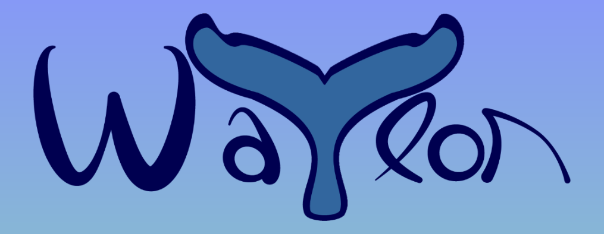

## A JavaScript long-term work-in-progress

### Waylon the Whale responds to a user's 'whale-song' by swimming up and down based on the pitch of the user's voice.

This app will utilize the WebAudio API to allow users to interact via their microphone. By analyzing the relative pitch (frequency) of audio input, Waylon the Whale will swim up or down as the user varies their vocal pitch.  Though currently the game is in its preliminary stages, the long-term goal is to develop a uniquely interactive (and hilariously embarrassing) scrolling game.


> "Maybe he only speaks whale."<br>
> "Are you sure you speak whale?"
##### FINDING NEMO
###### &copy; Walt Disney Pictures

### Technologies, Libraries, APIs
* Vanilla JS, HTML, CSS
* WebAudio API
* Canvas
  * SVG, assisted by Adobe Illustrator

### Backend Requirements
* None

### Primary Development Step (0.1.1)
* Implement collection and analysis of user audio input
  * Request access to user microphone
  * Compute frequencies of audio input and output *numerical* representations
``` javascript
  // create & configure Analyser node
  const analyser = audioCtxt.createAnalyser();
  analyser.fftSize = 2048;
  analyser.minDecibels = -50;
  analyser.smoothingTimeConstant = .5;
  // create buffer array of length 1/2 fftSize
  let audioArray = new Uint8Array(analyser.frequencyBinCount);


  // get audio stream from user microphone
  if (navigator.mediaDevices.getUserMedia) {
    const constraints = { audio: true };
    navigator.mediaDevices
      .getUserMedia(constraints)
      .then((stream) => {
        let source = audioCtxt.createMediaStreamSource(stream);
        source.connect(analyser);
        // connecting audioCtxt.destination
        //   ( analyser.connect(audioCtxt.destination); )
        // results in speaker output of user audio input, which
        // is confusing at this point. Maybe re-add later.
      })
      .catch((err) => console.log("Encountered getUserMedia error: " + err));
  } else {
    console.log("This browser doesn't support getUserMedia!");
  }

  // to get index with greatest value
  function indexOfGreatestFrequency(arr) {
    if (arr.length === 0) return null;
    let maxVal = arr[0];
    let maxIdx = 0;
    for (let i = 1; i < arr.length; i++) {
      if (arr[i] > maxVal) {
        maxIdx = i;
        maxVal = arr[i];
      }
    }
    return maxIdx;
  }
```
* Render simple gradient background
* Render `<div>` with `.png` background to represent Waylon whale character
* Manipulate DOM based on variations in audio frequency (higher/lower pitch)
``` javascript
  const moveWaylon = (newPitch) => {
    if (newPitch > currentPitch) {
      currentPosition -= 3;
      currentRotation -= 5;
    } else if (newPitch < currentPitch) {
      currentPosition += 3;
      currentRotation += 5;
    }
    if (currentPosition < 1) {
      currentPosition = 0;
      currentRotation = 0;
      blow.style.opacity = 0.8;
    } else {
      blow.style.opacity = 0;
    };
    if (currentPosition > 80) {
      currentPosition = 80;
      currentRotation = 0;
    };
    if (currentRotation > 35) currentRotation = 35;
    if (currentRotation < -25) currentRotation = -25;
    currentPitch = newPitch;

    waylon.style.top = currentPosition + "%";
    waylon.style.transform = `rotate(${currentRotation}deg)`;
  }
```
  * Animate via manipulation of HTML elements' style vs. Canvas
    * Animation appears smoother and simpler than the constant re-drawing of Canvas
* Render bare bones user instructions modal

### Next Phase (0.1.2)
* Add visual complexity
  * Render originally drawn cute whale character
  * Style frame and overall page view
* Add waves at the surface
* Animate waves to scroll constantly from right to left
* Add enemy for Waylon to dodge
  * Orca
* Animate enemy to move from right to left at constant "depth"
* Spawn enemy at a range of positions, sizes, and speeds
* Style so game aspect ratio is maintained if window is resized

### Uh-Oh (0.1.3)
* Implement collision logic
  * *Things got hairy here. Using HTML styling I had been able to create smoothly scrolling waves and orcas, a smoothly rotating Waylon swimming upward and downward on cue, even a smoothly dissipating little puff of misty breath when Waylon reached the surface. However, I ran seriously aground when I tried to calculate whether Waylon and the orca were in collision, particularly when accounting for resized windows. Not much of a game if Waylon can just swim through every obstacle without consequence...*
  * *There may have been a solution, but I didn't see it at the time. Long story short, for better or worse I took a friend's advice and began retooling the game to use Canvas after all.*

### Back to the Drawing Board (0.2)
* Convert entire game to be drawn within a Canvas context
* *I had designed the Waylon character image, as well as the orca, as scalable vector graphics with Adobe Illustrator. I won't say it was a breeze to convert those into Canvas drawing instructions, but it did make it way easier than starting that process from scratch.*


### Future Steps

* Audio output (if it doesn't interfere with user microphone input)
  * Background music
  * Clip of humpback whale song plays when instructions modal is rendered
  * Mute button
  * Volume slider or buttons
* Animated panel-by-panel intro story set-up
  * "As they began their 5,000 mile seasonal migration from tropical calving waters to their polar feeding zone...
  * Boom!
  * ...PetroChem, Inc.'s seismic blasting stunned and disoriented a pod of humpback whales.
  * By the time their ears recovered...
  * ...poor baby WAYLON's Momma was nowhere to be seen.
  * Use your whale-song to guide baby Waylon over the long, dangerous journey to the safety of Momma's shadow."
* Tutorial segment, to accustom users to the unusual controls
* Add more Enemies and Obstacles
  * Tiger Sharks
  * Giant squid
  * Jellyfish
  * Rock & coral formations
  * Trawlers with nets
  * Submarines
  * Pollution
* Distance covered (score)
  * High Score persistence
* Hit points or Lives with badges or meter animation
  * Healing items (krill, schools of tiny fish)
* Need to breathe
  * Limited breath capacity with meter animation
* Different angles/speeds of diving/surfacing by speed/degree of pitch change
* Levels/waves of challenges
* Amusing messages when user "kills" Waylon
  * Perhaps playing-back the user's last second of audio input with modal "translation" and "You need to brush-up your Whale."
  * Translation: "Swim into the shark's mouth!!!"
  * Translation: "Orcas are your friends!"
  * Translation: "Breathing is for chumps!"
  * Translation: CENSORED
* "Embarrassment-Free Mode" - with button controls (in case people around user are staring at them as they make whale noises)
