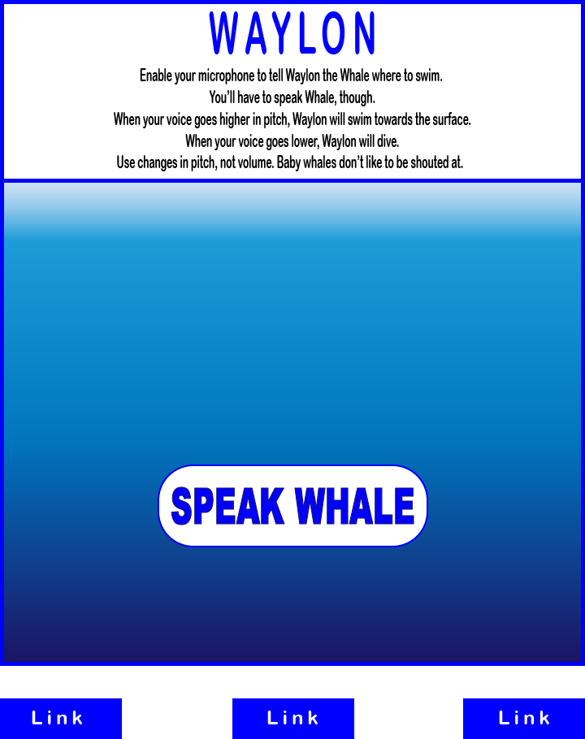

# :whale2: WAYLON :whale2:

## A JavaScript long-term work-in-progress

### Waylon the Whale responds to a user's 'whale-song' by swimming up and down based on the pitch of the user's voice.

This app will utilize the WebAudio API to allow users to interact via their microphone. By analyzing the relative pitch (frequency) of audio input, Waylon the Whale will swim up or down as the user varies their vocal pitch.  This is intended as the first step in the development of a uniquely interactive (and hilariously embarrassing) scrolling game.

> "I can speak whale."

### Primary Development Step MVPs
* Collection and analysis of user audio input
  * Request and implement access to user microphone
  * Compute frequencies of audio input and output *numerical* representations
* Render simple background and graphic representation of Waylon whale character
* Manipulate DOM based on variations in audio frequency (higher/lower pitch)
* Render user instructions modal
* Bonus MVPs
  * Add visual complexity
    * Render fully realized, animated, and cute whale character
    * Add detail, animation to background
    * Style frame and overall page view
  * Audio output
    * Music for splash?
    * Clip of humpback whale song plays when instructions modal is rendered
    * Mute button

### Technologies, Libraries, APIs
* Vanilla JS, HTML, CSS
* WebAudio API
* Vector graphic animation. 
  * SVG, assisted by Adobe Illustrator

### Anticipated Technical Challenges
* Mathematical understanding, particularly trigonometry, involved in working with Fourier Transforms
  * As a performing-artist, my math education never reached Trigonometry
  * To meet this challenge, I'll:
    * Cram lessons on trig, but narrow focus to Fourier Transforms
    * Tutorial videos, lectures, and articles are widely available, if dense
* Difficulty of isolating clear user input for DOM manipulation
  * Complexity of human vocal waveforms
  * Diversity of human voices
  * To meet this challenge, I'll:
    * Leverage WebAudio API's functionality
    * Research data on human vocal frequencies
    * Through game's theme, encourage exaggerated dynamic use of vocal pitch (frequency) from user (think Dory imitating "whale" language)
* Server-side computation will likely be heavy
  * To meet this challenge, I'll:
    * Narrow range of sampled frequencies as much as possible
    * Experiment with low sample rates, since this audio data will not be output
    * Limit iteration where possible
    * Investigate techniques utilized by other programmers for optimizing performance
    
### Backend Requirements
* None

### Wireframes

### Timeline: Primary Step
* __Day One:__
  * Learn Web Audio API
  * Mathematical research, as required
  * Vocal analysis research, as required
  * Develop code for collection and analysis of microphone audio input
  * __Goals:__ 
    * Be able to collect and process audio data
    * Output results *numerically*
    * Ensure output data responds reliably to vocal variation
  * __Extras:__
    * Get head-start on Day Two visual design
* __Day Two:__
  * *Basic* HTML structure and SCSS styling
  * Learn SVG composition using Adobe Illustrator
  * Create and export *basic* SVG design for Waylon character
  * Manipulate Waylon's position on the DOM based on audio input
  * __Goals:__
    * Render basic-looking single game page
    * Working hyperlinks to Online Presence (Github etc.)
    * Temporary instructions section (non-modal)
    * Rudimentary Waylon character swims up/down with user vocal input
  * __Extras:__
    * Work on making splash/instructions modal
    * Embellish visual design
* __Day Three:__
  * __Buffer for debugging and delays__
  * Create splash/instructions modal
  * Embellish page styling
  * __Goals:__
    * Clean, decent-looking design
    * Splash/instructions modal
    * Links to Online Presence
    * Reliable interactivity
    * Clean README
  * __Extras:__
    * Embellish SVG character design
    * Blowhole effect when Waylon reaches surface
    * Animate Waylon
    * Begin scrolling background functionality
    
### Future Steps
* Visual embellishment
* Sound effects (if they don't interfere with user input)
  * Volume
  * Mute
* Scrolling background
* Animated splash story set-up
  * "As they began their 5,000 mile seasonal migration from tropical calving waters to their polar feeding zone...
  * Boom!
  * ...PetroChem, Inc.'s seismic blasting stunned and disoriented a pod of humpback whales.
  * By the time their ears recovered...
  * ...poor baby WAYLON's Momma was nowhere to be seen.
  * Use your whale-song to guide baby Waylon over the long, dangerous journey to the safety of Momma's shadow."
* Obstacles
  * Rock & coral formations
  * Trawlers with nets
  * Submarines
  * Pollution
  * Mobile enemies (orcas, sharks)
* Distance covered (score) with High Score persistence
* Hit points or Lives with badges or meter animation
  * Healing items (krill, schools of tiny fish)
* Need to breathe
  * Limited breath capacity with meter animation
* Different angles/speeds of diving/surfacing by speed/degree of pitch change
* Levels/waves of challenges
* Amusing messages when user "kills" Waylon
  * Perhaps playing-back the user's last second of audio input with modal "translation" and "You need to brush-up your Whale."
  * Translation: "Swim into the shark's mouth!!!"
  * Translation: "Orcas are your friends!"
  * Translation: "Breathing is for chumps!"
  * Translation: CENSORED
* "Embarrassment-Free Mode" - with button controls (in case people around user are staring at them as they make whale noises)
